# Ledgr

A personal finance tracking application for iOS and Android, built with React Native and Expo. Ledgr helps users manage transactions, accounts, budgets, and recurring rules — all stored locally on-device with no backend dependency.

---

## Table of Contents

- [Screenshots](#screenshots)
- [Features](#features)
- [Tech Stack](#tech-stack)
- [Prerequisites](#prerequisites)
- [Getting Started](#getting-started)
- [Project Structure](#project-structure)
- [Architecture](#architecture)
- [Localization](#localization)
- [Data & Privacy](#data--privacy)
- [License](#license)

---

## Screenshots

<table>
  <tr>
    <td align="center">
      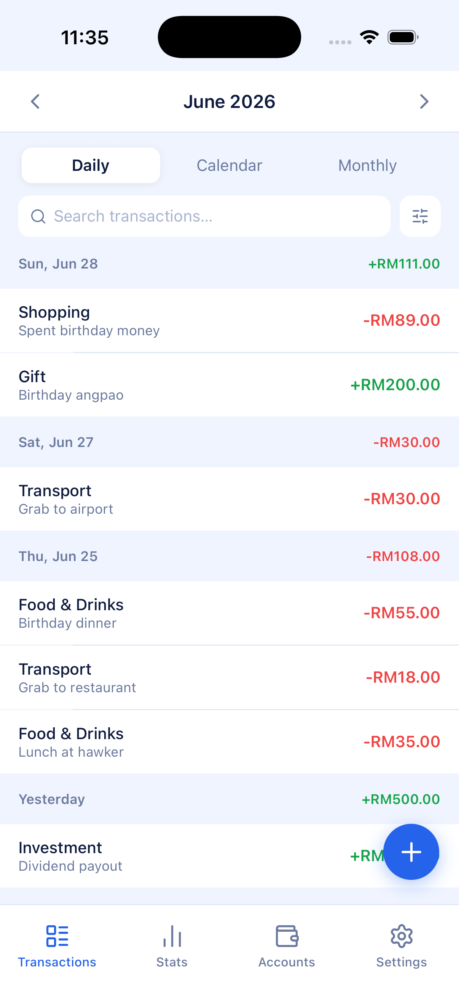<br/>
      <sub><b>Transactions - Daily</b></sub>
    </td>
    <td align="center">
      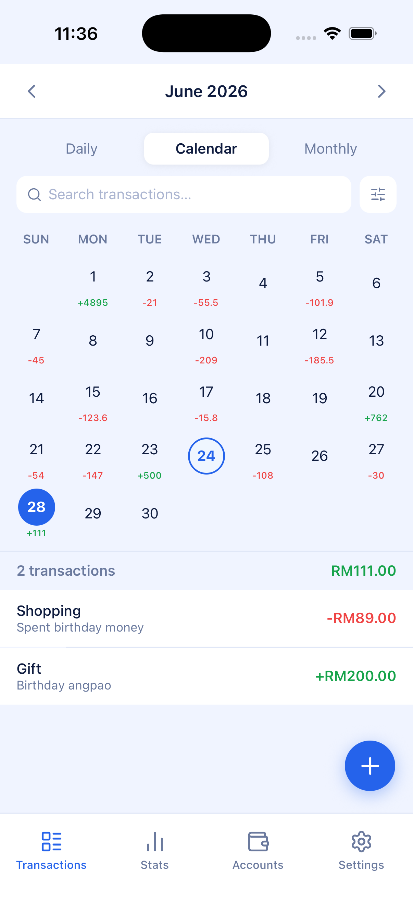<br/>
      <sub><b>Transactions - Calendar</b></sub>
    </td>
    <td align="center">
      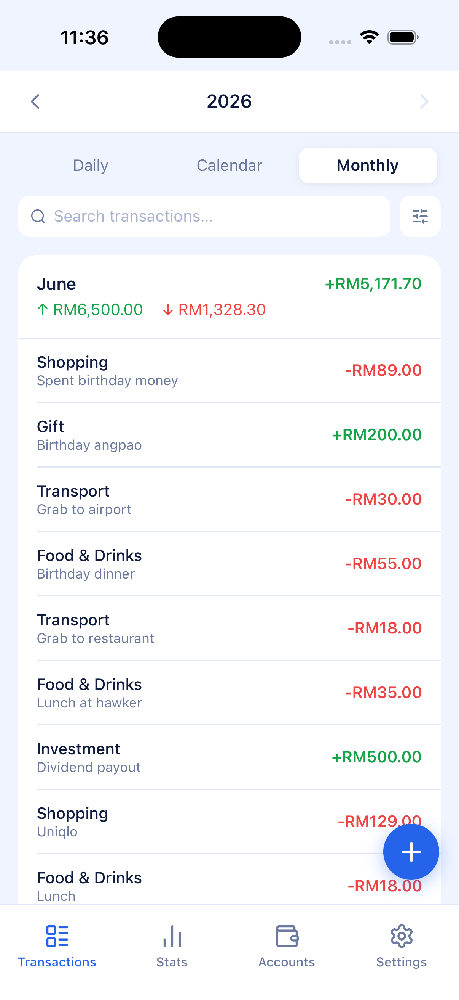<br/>
      <sub><b>Transactions - Monthly</b></sub>
    </td>
    <td align="center">
      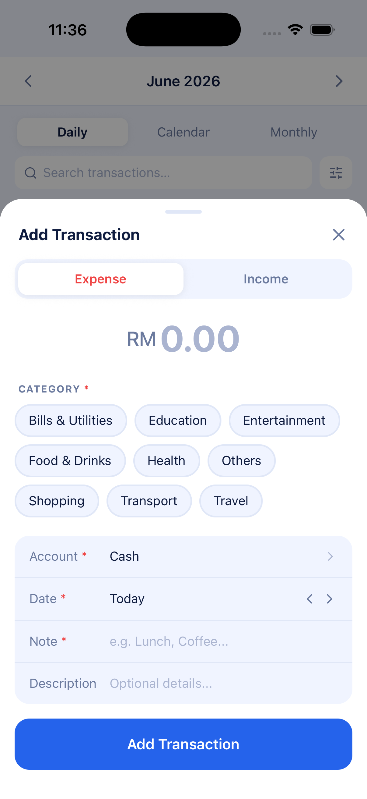<br/>
      <sub><b>Add Transaction</b></sub>
    </td>
  </tr>
  <tr>
    <td align="center">
      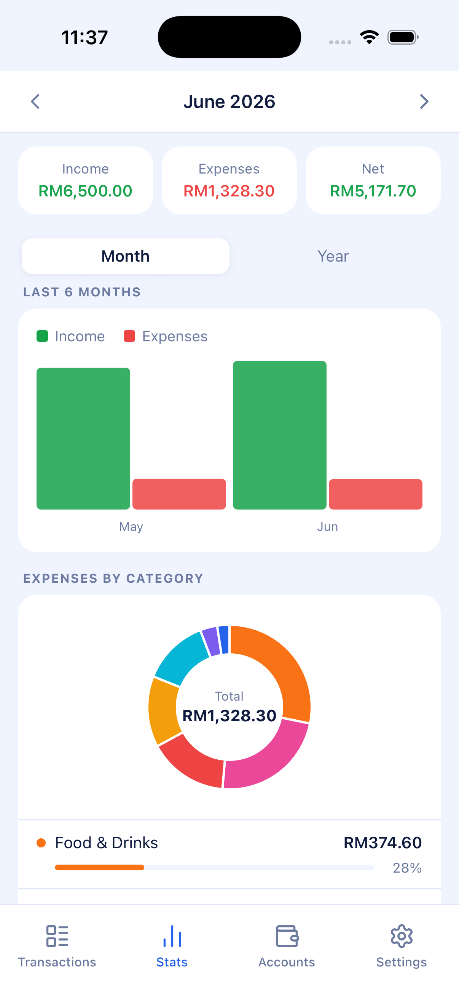<br/>
      <sub><b>Statistics — Monthly 1st section</b></sub>
    </td>
    <td align="center">
      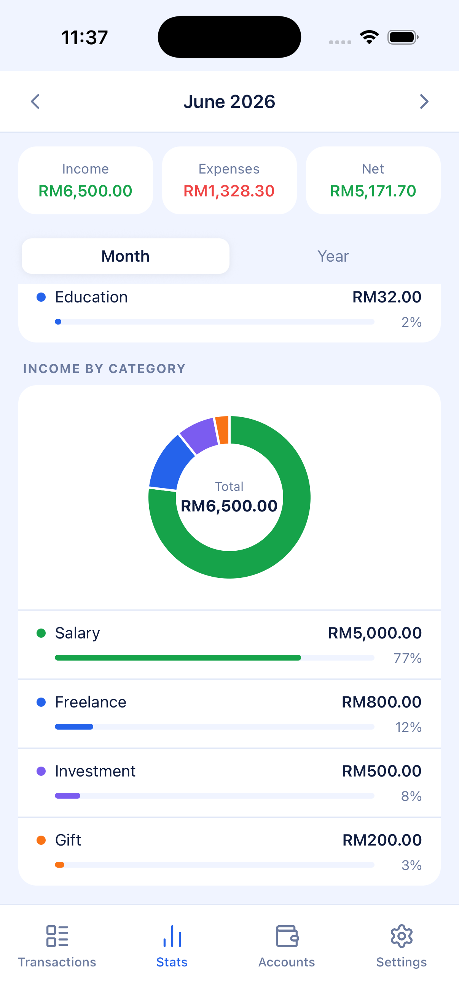<br/>
      <sub><b>Statistics — Monthly 2nd section</b></sub>
    </td>
    <td align="center">
      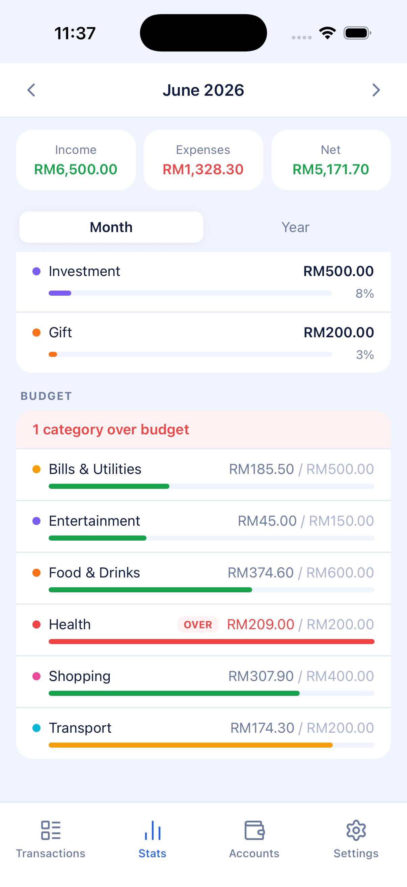<br/>
      <sub><b>Statistics — Monthly 3rd section</b></sub>
    </td>
    <td align="center">
      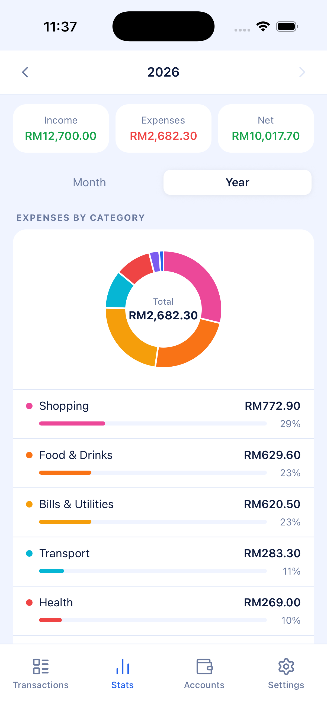<br/>
      <sub><b>Statistics — Annual</b></sub>
    </td>
  </tr>
  <tr>
    <td align="center">
      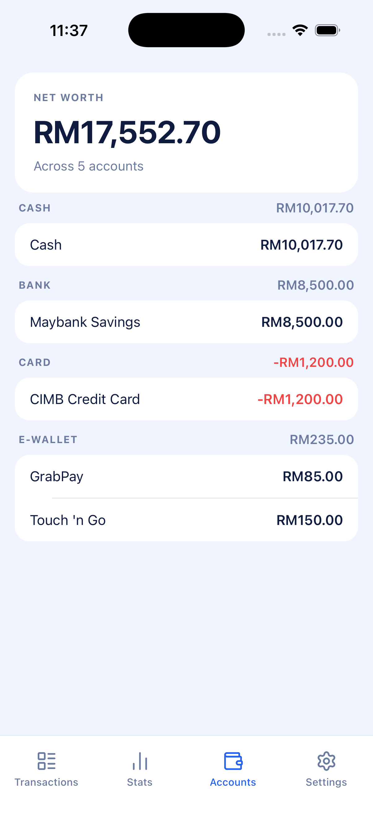<br/>
      <sub><b>Accounts</b></sub>
    </td>
    <td align="center">
      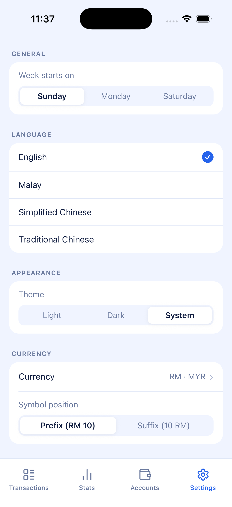<br/>
      <sub><b>Settings - General, Language, Appearance, Currency</b></sub>
    </td>
    <td align="center">
      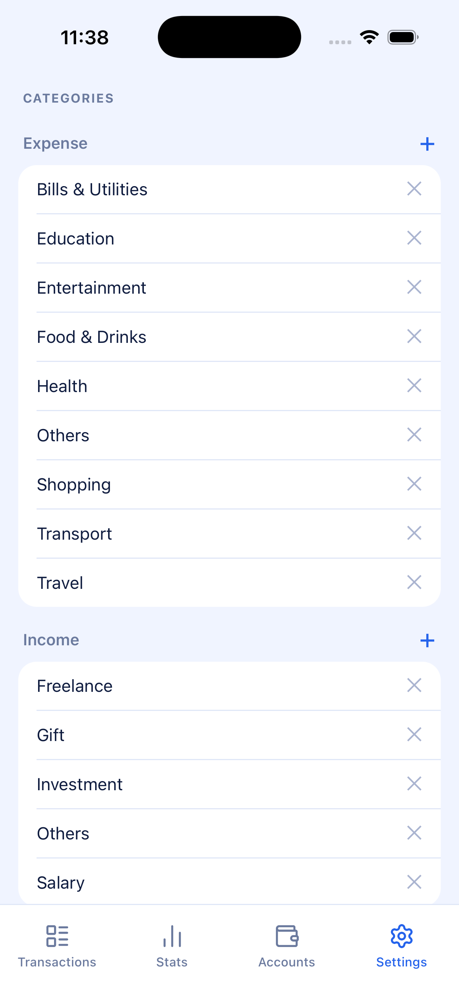<br/>
      <sub><b>Settings - Categories</b></sub>
    </td>
    <td align="center">
      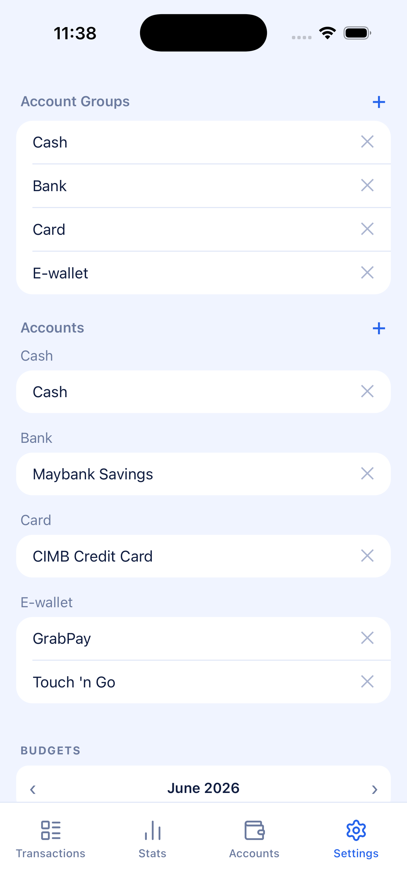<br/>
      <sub><b>Settings - Account Groups and Accounts</b></sub>
    </td>
  </tr>
  <tr>
    <td align="center">
      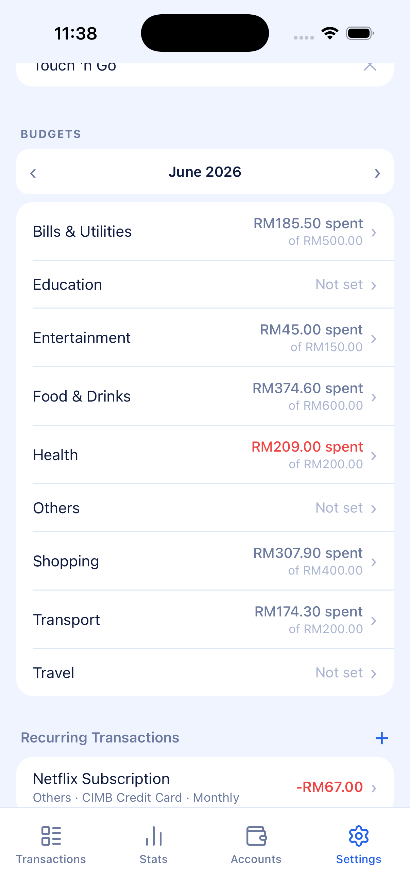<br/>
      <sub><b>Settings - Budgets</b></sub>
    </td>
    <td align="center">
      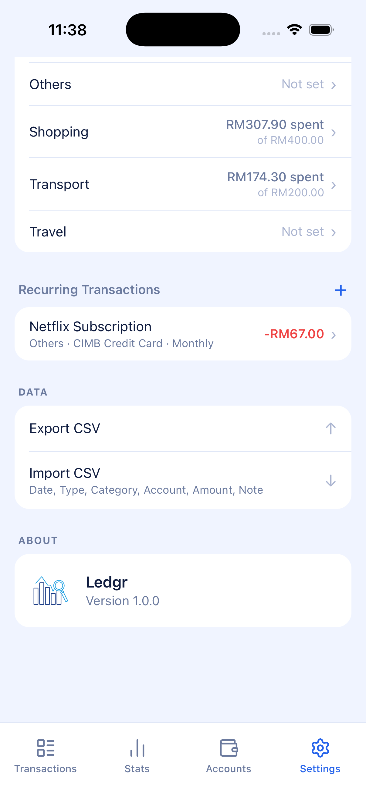<br/>
      <sub><b>Settings - Recurring Transactions, Data, About</b></sub>
    </td>
  </tr>
</table>

---

## Features

| Area | Details |
|---|---|
| **Transactions** | Add, edit, and delete income/expense entries with category, account, date, note, and optional description |
| **Accounts** | Multiple accounts with grouping, per-account balance tracking, and net worth summary |
| **Budgets** | Monthly category budgets with per-month overrides and over-budget alerts |
| **Recurring Rules** | Automated recurring transactions on daily, weekly, biweekly, monthly, end-of-month, bimonthly, and annual schedules |
| **Statistics** | Monthly and annual summaries, 6-month income/expense trend chart, and category breakdown donut charts |
| **CSV Import/Export** | Export transactions as CSV; import from a compatible CSV file |
| **Appearance** | Light, dark, and system-adaptive themes |
| **Localization** | English, Bahasa Melayu, Simplified Chinese, Traditional Chinese |
| **Currency** | Configurable currency symbol and position (prefix/suffix) |
| **Week Start** | Configurable week start day (Sunday, Monday, Saturday) |

---

## Tech Stack

| Layer | Technology |
|---|---|
| Framework | [Expo](https://expo.dev) SDK 56 |
| Runtime | React Native 0.85.3 (New Architecture enabled) |
| Navigation | [Expo Router](https://expo.github.io/router) v4 (file-based) |
| Database | [expo-sqlite](https://docs.expo.dev/versions/latest/sdk/sqlite/) — on-device SQLite |
| Server state | [TanStack Query](https://tanstack.com/query/latest) v5 |
| Styling | [NativeWind](https://www.nativewind.dev) v4 (Tailwind CSS for React Native) |
| Language | TypeScript 6 |
| Icons | [Lucide React Native](https://lucide.dev) |

---

## Prerequisites

- **Node.js** 20 or later
- **npm** 10 or later
- **Expo CLI** — install globally with `npm install -g expo-cli`
- **Xcode** 16+ (iOS builds, macOS only)
- **Android Studio** (Android builds, optional)
- An iOS Simulator or physical device registered in your Apple Developer account

---

## Getting Started

### 1. Clone the repository

```bash
git clone https://github.com/ivanwong/budget-tracker-mobile.git
cd budget-tracker-mobile
```

### 2. Install dependencies

```bash
npm install
```

### 3. Run on iOS Simulator

```bash
npm run ios
```

### 4. Run on Android Emulator

```bash
npm run android
```

### 5. Start the Expo development server only

```bash
npm start
```

> **Note:** The first launch initialises the SQLite database and seeds default categories. Subsequent launches load from the existing database without re-seeding.

---

## Project Structure

```
.
├── app/                        # Expo Router screens
│   ├── _layout.tsx             # Root layout — providers, DB init, recurring processor
│   └── (tabs)/
│       ├── index.tsx           # Transactions screen
│       ├── stats.tsx           # Statistics screen
│       ├── accounts.tsx        # Accounts screen
│       └── settings.tsx        # Settings screen
│
└── src/
    ├── components/             # UI components grouped by domain
    │   ├── transactions/       # AddTransactionSheet, FilterSheet, SummaryCards, …
    │   ├── settings/           # RecurringRuleSheet, category/account/budget sheets
    │   ├── stats/              # TrendChart, DonutChart
    │   └── ui/                 # MonthHeader, shared primitives
    │
    ├── context/
    │   ├── ThemeContext.tsx     # Theme provider and useColors hook
    │   └── LanguageContext.tsx # Language provider and useStrings hook
    │
    ├── db/
    │   ├── client.ts           # SQLite connection singleton
    │   └── schema.ts           # CREATE TABLE statements and migrations
    │
    ├── hooks/                  # TanStack Query hooks (one file per domain)
    ├── services/               # Raw SQLite query functions (no React)
    ├── lib/                    # Pure utilities: currency, date, i18n, constants
    └── types/                  # Shared TypeScript types and interfaces
```

---

## Architecture

### Data layer

All data is persisted in a single SQLite file managed by `expo-sqlite`. The database is opened once at app start (`src/db/client.ts`) and the schema is initialised synchronously (`src/db/schema.ts`). Query functions in `src/services/` are plain TypeScript with no framework dependency. React components access data exclusively through TanStack Query hooks in `src/hooks/`, which wrap the service functions and handle caching, background refetching, and optimistic updates.

### State management

There is no global client-side state store. All server state lives in the TanStack Query cache. Ephemeral UI state (sheet open/close, form fields) is local `useState` inside each component.

### Recurring transactions

On every app launch, `src/services/recurring.ts` checks all active recurring rules against today's date and creates any transactions that are due. This runs synchronously in a `useEffect` inside the root layout so it completes before the first query results render.

### Navigation

File-based routing via Expo Router. All screens live under `app/(tabs)/` and are presented in a native bottom tab bar. Sheets (add transaction, filter, recurring rule editor, etc.) are custom animated bottom sheets implemented with the React Native `Animated` API via the shared `useBottomSheet` hook.

---

## Localization

Translations are defined in `src/lib/i18n.ts` as a `Strings` type with four translation objects: `en`, `ms`, `zhHans`, `zhHant`. The active language is read from the user's settings row in SQLite and applied via `LanguageContext`. All UI-visible strings are accessed through the `useStrings()` hook — no hardcoded English appears in component files.

To add a new language:

1. Add an entry to the `Language` union in `src/types/index.ts`.
2. Add a new translation object in `src/lib/i18n.ts` implementing the `Strings` type.
3. Register it in the `translations` map at the bottom of `i18n.ts`.
4. Add the language option to the language picker in `app/(tabs)/settings.tsx`.

---

## Data & Privacy

All user data is stored exclusively on-device in the local SQLite database. No data is transmitted to any server. The CSV export feature writes a file to the device's local file system and uses the native share sheet — it does not upload data to any third-party service.

---

## License

Copyright © 2026 Wong Yit Meng. Released under the [MIT License](LICENSE).
